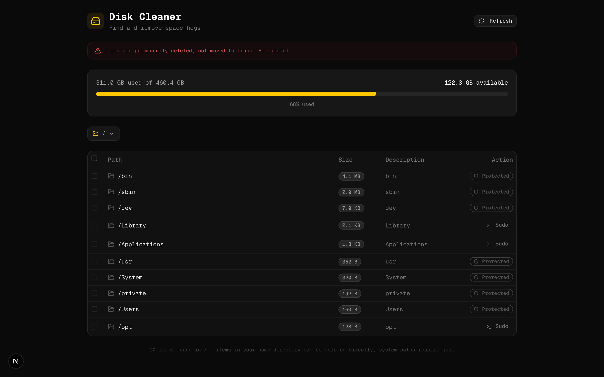

# Disk Cleaner

A local web app that scans your disk for space hogs and lets you delete them with one click, or gives you the sudo command if it can't.

## Screenshot



## Features

- **Disk usage overview** — see total, used, and available space at a glance
- **Drill-down navigation** — click any folder to scan deeper
- **Quick paths** — jump to Root, Home, Applications, Library, Volumes
- **Custom path input** — scan any directory
- **One-click delete** — delete items directly from the UI
- **Bulk select** — checkbox multi-select with "Delete Selected"
- **Sudo handling** — gives you the terminal command for protected paths
- **Size badges** — color-coded (red for 10GB+, yellow for 1GB+)
- **Protected labels** — system-critical paths are marked and blocked from deletion

## Tech

- **Next.js 15** (App Router) + TypeScript
- **shadcn/ui** + Tailwind CSS — dark theme
- **Lucide Icons**
- Local API routes (`/api/scan`, `/api/delete`) — no external services

## Run

```bash
git clone https://github.com/1shanpanta/disk-cleaner.git
cd disk-cleaner
pnpm install
pnpm dev
```

Opens at [localhost:3000](http://localhost:3000). Everything runs locally — no accounts, no cloud.
